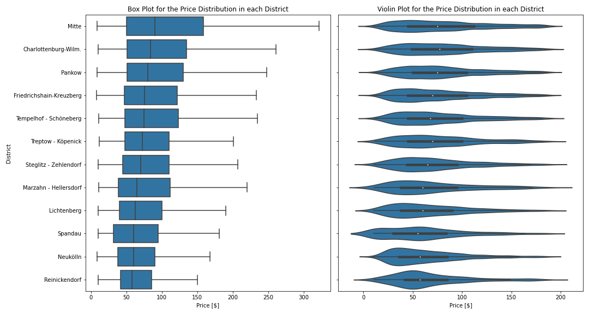

# AirBnB Berlin Pricing Analysis Over the Year 2023

## Overall Distribution of Listing Prices

The figure above illustrates that prices largely follow a shape resembling a normal distribution when plotted on a logarithmic scale. A significant proportion of prices are clustered between 50 \\$ and 200 \\$. Very few listings fall below the 15 \\$ mark or exceed 1000 \\$.

Due to the right-skewed nature of the price distribution, the mean value is skewed upwards by outliers with high prices. Consequently, the mean might not be the most representative measure of central tendency for this distribution. The median, however, appears more indicative, aligning closely with the mean of the log-normal distribution. Thus, our subsequent analyses will prioritize the median as the central tendency measure.

## Location Dependent Prices

Now that we've examined the price distribution, we can explore how prices vary based on other variables. Let's first consider the impact of a rental unit's location on its price.

As depicted above, Friedrichshain-Kreuzberg and Berlin Mitte account for the majority of listings. These districts are recognized as affluent areas of Berlin with a higher cost of living. Conversely, fewer listings are found in less prosperous and potentially riskier areas such as Marzahn-Hellersdorf, Spandau, and Steglitz-Zehlendorf.

The box and violin plots below further elucidate the price distributions across districts:

These plots emphasize the declining trend in prices as we move from central districts like Berlin Mitte to less central ones such as Spandau and Neukölln. The violin plot, in particular, reveals the varying densities of price distributions across districts.

In summary, the preponderance of listings in wealthier districts may be attributed to investors seeking higher returns from areas with increased demand and potentially higher profit margins.

## Price Evolution Over the Year 2023

To complement our understanding of location-based pricing, let's delve into how prices fluctuated over the past 10 months.

Surprisingly, the median price displayed a consistent upward trend over the referenced period. While one might expect price surges during peak demand periods like summer or Christmas, it's worth noting that 2023 experienced a significant rise in inflation, especially up to September/October. This inflationary trend could have influenced the pricing of AirBnB listings in Berlin.

## Are There Any Patterns in Amenities Shared by High Prices Rental Units?

The amenities offered by a property could be as influential as its location in determining its price. To investigate this, we segmented our data based on the price brackets and compared the frequency of various amenities.

It's evident that high-priced listings often boast specific amenities like ironing facilities, toaster, and coffee maker. Notably, safety equipment such as smoke alarms and fire extinguishers are more prevalent in these listings. On the other hand, certain amenities or features, like allowing smoking, appear more common in lower-priced properties.

## Which Features Affect Price the Most?

After gaining insights into how different features correlate with prices, our final step is to determine the most influential factors.

In a prior regression analysis, the results raised some questions regarding the suitability of a linear model for our dataset. To address these concerns and possibly capture non-linear relationships, we evaluated mutual information scores for the features.

This analysis offered some new perspectives:

- Geographical location (latitude/longitude) emerged as a predominant factor in determining prices, reaffirming our earlier observations about proximity to the city center.
- While amenities did influence pricing, their impact seemed overstated in our initial linear regression analysis. In contrast, the significance of reviews, especially ratings, might have been previously understated.

