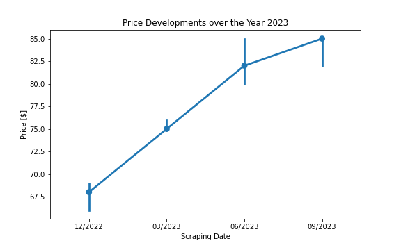

# AirBnB Berlin Pricing Analysis Over the Year 2023

## Introduction

The AirBnB dataset provides insights into the burgeoning peer-to-peer rental market in Berlin, showcasing a range of properties from cozy rooms to luxurious apartments. As tourism and short-term rentals become more popular in the city, understanding the factors that influence pricing is essential for both potential hosts and visitors. This analysis aims to determine the distribution of listing prices, the influence of location on pricing, the changes in pricing trends over time, and the impact of amenities and other features on price.

## Overall Distribution of Listing Prices

To get a sense of the general landscape, we first look at how the listing prices are distributed across the city.

From the plot, it's clear that prices are mostly concentrated between 50 \\$ and 200 \\$. The median price offers a better representation of the typical listing price than the mean due to the influence of high-priced outliers.

## Location Dependent Prices

Next, we seek to understand how location affects the number of listings and their respective prices.

The districts of Friedrichshain-Kreuzberg and Berlin Mitte have the highest number of listings. These areas are popular and have a higher cost of living.

The data suggests that prices are generally higher in central districts and decrease as we move towards the city's outskirts.

## Price Evolution Over the Year 2023

To understand how listing prices have changed over time, we look at the price trends throughout the year.

There's a steady increase in the median price for rentals during the year. This could be due to various factors, including inflation in 2023.

## Amenities and Their Influence on Pricing

We're interested in seeing if certain amenities are more prevalent in higher-priced listings.

The data shows that listings with higher prices often include amenities like ironing facilities, toasters, and coffee makers. On the other hand, amenities such as smoking permissions are more common in lower-priced listings.

## Features and Their Impact on Price

Lastly, we aim to identify which features have the most significant impact on pricing.

Location, especially latitude and longitude, greatly affects prices. Guest reviews and ratings also play a crucial role in determining price.

## Conclusion

Our analysis provides several insights into the AirBnB rental market in Berlin:

- Most prices range between 50 \\$ and 200 \\$.
- Central areas have a higher number of listings and typically command higher prices.
- Rental prices have increased throughout the year, possibly influenced by external factors like inflation.
- Amenities do play a role in pricing, but location and guest feedback are more significant determinants.

These findings can help hosts set competitive prices and allow guests to make informed rental decisions.

